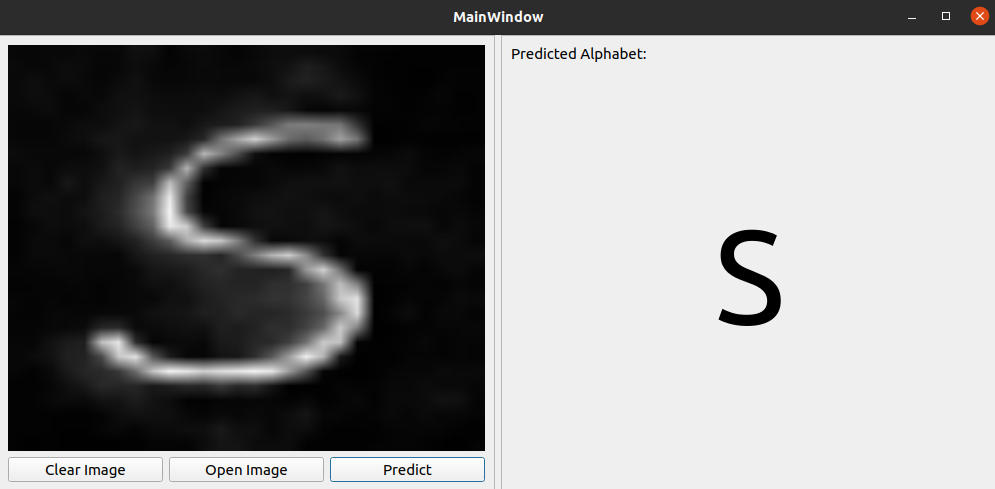

# Handwritten English Alphabet Classifier

An application that can predict single handwritten alphabets in images.


# Requirements
* Python3
* PyQt5
* Tensorflow
* Keras
* Scikit-learn
* Numpy
* Pandas
* Seaborn
* OpenCV (for preprocessing script)
* Pillow (for converting CSV dataset to images (if needed))

# Usage
1. Launch the application using `python3 main.py`
2. Load the image using the button provided.
3. Click on `Predict` button.
4. The predicted alphabet will be displayed.

Note: For optimal results, the image to be loaded should first be processed using `preprocessing.py` script. The script converts the image to grayscale and also resizes to 28x28.

# Dataset Used
The dataset for the application can be found [**HERE**](https://www.kaggle.com/sachinpatel21/az-handwritten-alphabets-in-csv-format).
The `csvToImage.py` script in the directory converts the `.csv` file to images. Specify the `csv_File_Path` variable inside the script.  

# Model and Model Training
The trained model is located in the `model` folder. 
To train your own model, make changes to the `model_train.py` script in the directory.

# Directory Tree
```bash
├── csvToImg.py
├── LICENSE
├── main.py
├── model
│   └── model.h5
├── model_train.py
├── prediction.py
├── preprocessing.py
├── README.md
└── ui
    └── main.ui
```